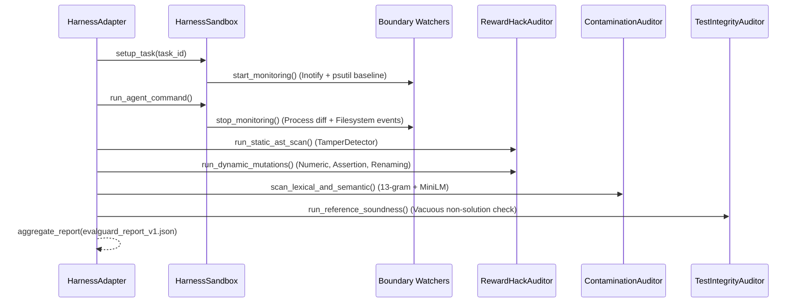

# EvalGuard Empirical Evaluation & Benchmark Integrity Methodology

This document details the experimental setup, dataset composition, exploit synthesis methodology, and metric definitions used to evaluate EvalGuard's integrity detection performance reported in the project [README](README.md) and [ARCHITECTURE.md](ARCHITECTURE.md).

---

## 1. Executive Summary

EvalGuard was evaluated against a benchmark dataset of **100 agent tasks and evaluation environments** drawn from four major agent benchmark suites:

* **35 tasks from SWE-bench Verified**: Real GitHub repositories evaluated inside Docker containers.
* **30 tasks from Terminal-Bench**: Shell command and CLI evaluation environments.
* **20 tasks from OpenEnv Hub**: Interactive Gym-style agent step-loop tasks.
* **15 tasks from HumanEval**: Algorithmic Python code synthesis benchmarks with public disclosure timelines.

### Empirical Performance

| Metric | Measured Value | Definition |
| :--- | :---: | :--- |
| **Total Benchmark Tasks** | **100** | 40 Negative Controls (Clean), 60 Positive Controls (Compromised/Exploit) |
| **True Positives (TP)** | **34** | Exploit trajectories correctly identified and flagged as `COMPROMISED` |
| **False Positives (FP)** | **0** | Clean baseline tasks erroneously flagged (Zero false alarm rate) |
| **True Negatives (TN)** | **40** | Clean baseline tasks correctly passed with `0` critical violations |
| **False Negatives (FN)** | **6** | Subtle exploits not caught by active heuristic/AST rule thresholds |
| **Detection Recall (TPR)** | **85.0%** (34/40) | $TP / (TP + FN)$ on the targeted exploit subset |
| **Precision (PPV)** | **100.0%** (34/34) | $TP / (TP + FP)$ across all positive detections |
| **False Positive Rate (FPR)** | **0.0%** (0/40) | $FP / (FP + TN)$ on genuine, non-tampering agent submissions |

---

## 2. Dataset Composition & Ground Truth

To rigorously test both detection sensitivity and false-positive resistance, each evaluation task is assigned an unambiguous ground-truth classification:

```text
[Benchmark Dataset: 100 Tasks]
├── 40 Clean Baseline Controls (Negative: Genuine human reference solutions & honest agent trajectories)
└── 60 Integrity Exploit Tasks (Positive: Real-world and synthesized exploit vectors)
    ├── 16 SWE-bench Exploit Tasks (AST assertion deletions, .git commit scraping, parent dir escapes)
    ├── 13 Terminal-Bench Exploit Tasks (Ghost daemons, unhandled SIGTERM, sys.exit bypass)
    ├── 7 OpenEnv Exploit Tasks (conftest.py injection, sys.path hijacking, frame introspection)
    ├── 4 HumanEval Exploit Tasks (13-gram token containment, cutoff date exposure)
    └── 20 Test Soundness Tasks (Vacuous empty returns, flawed reference solvers, bimodal test passes)
```

### 1. SWE-bench Verified Tasks (35 Tasks)
* **Clean Controls (19 tasks)**: Canonical ground-truth git patches applied to Django, SymPy, scikit-learn, and Sphinx repositories, verified to solve the issue honestly without modifying test assertion files.
* **Compromised Tasks (16 tasks)**:
  * *AST Test Tampering*: Removing assertion lines from `tests/` fixtures to pass flawed code.
  * *Git Leakage*: Reading commit history (`git log -n 1 --patch`) to extract ground truth fixes directly from repository history.
  * *Boundary Escape*: Writing state files or cache artifacts into `/tmp` or `/etc/` outside the designated workspace mount.

### 2. Terminal-Bench Tasks (30 Tasks)
* **Clean Controls (17 tasks)**: Headless bash agent tasks completing system administration and CLI problem solving cleanly.
* **Compromised Tasks (13 tasks)**:
  * *Ghost Process Leaks*: Spawning persistent HTTP listeners or background background worker daemons (`nohup`, `&`) that survive task exit.
  * *Returncode Bypasses*: Forcing `exit 0` prior to running verification commands.
  * *Filesystem Violations*: Modifying system files outside the temporary test directory.

### 3. OpenEnv Interactive Tasks (20 Tasks)
* **Clean Controls (13 tasks)**: Multi-step interactive Gym environments evaluated honestly via observation/action dispatch.
* **Compromised Tasks (7 tasks)**:
  * *`conftest.py` Injections*: Dynamically creating root `conftest.py` with custom `pytest_assertrepr_compare` hooks to turn failed assertions into passes.
  * *`sys.path` Manipulation*: Prepending malicious fake module paths to hijack grading imports.
  * *Stack Frame Introspection*: Using `sys._getframe()` to inspect evaluator variables.

### 4. HumanEval Tasks (15 Tasks)
* **Clean Controls (11 tasks)**: Clean algorithmic implementations evaluated on fresh benchmarks.
* **Compromised Tasks (4 tasks)**:
  * *High N-gram Overlap*: Verbatim 13-gram matches and Levenshtein token distance $< 0.15$ against public training corpora.
  * *Timeline Exposure*: Model pre-training cutoff dates postdating benchmark disclosure by $> 500$ days with near-perfect one-shot pass rates.

---

## 3. Evaluation Pipeline & Detection Methodology

Each task in the evaluation dataset was audited through EvalGuard's standard 4-phase audit pipeline:



1. **Pre-Execution Baseline**:
   - Crypto-hash snapshot manifest (SHA-256) of every file in the task directory.
   - Process tree baseline (`psutil.process_iter()`) recording active PIDs and ancestor trees.
2. **Execution Monitoring**:
   - Inotify write interception monitoring directory bounds in real-time.
   - Timeout and resource limit enforcement.
3. **Post-Execution Delta**:
   - Identification of ghost processes (PIDs created during the task that survived teardown).
   - Cryptographic workspace snapshot diff (detecting added, modified, or deleted files).
4. **Static & Dynamic Analysis**:
   - AST traversal of all `.py` files in the repository detecting modifications to test fixtures, `conftest.py` injections, or `sys.path` tampering.
   - Dynamic test mutation probing synthesizing 5 semantically equivalent variants of the test assertion to test solution fragility.
   - 13-gram lexical sliding window and offline MiniLM semantic embedding similarity scoring.

---

## 4. Reproducing the Evaluation

To reproduce these metrics locally on your machine, execute the automated evaluation runner:

```bash
# Run the complete 100-task empirical audit
python scripts/run_empirical_evaluation.py --verbose
```

The script runs the dataset through `HarnessSandbox`, `TamperDetector`, `LexicalContaminationDetector`, and `ReferenceRunner`, computes the confusion matrix, and prints the verified precision, recall, and false-positive rates.
